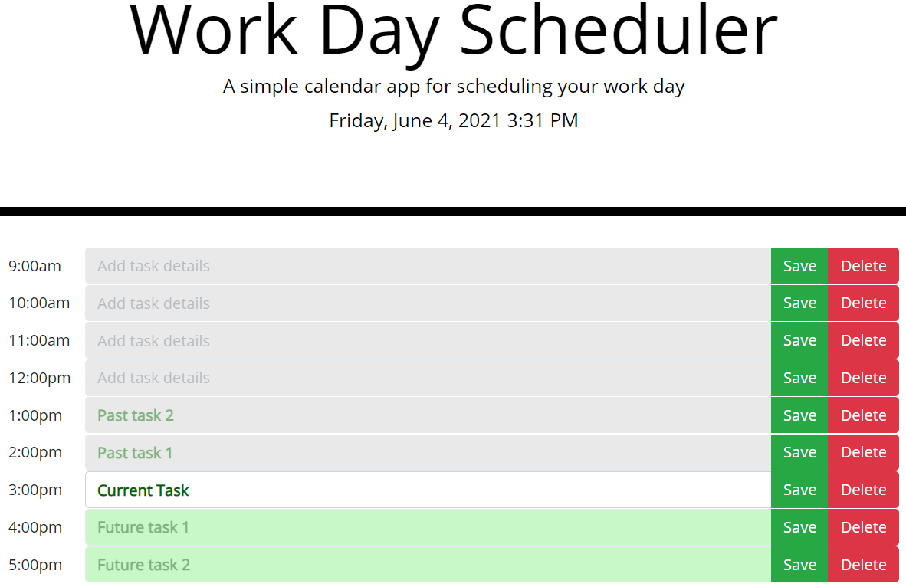

# WorkDayScheduler

## Technologies used:
* HTML
* CSS
* JavaScript
* Moment.js
* Bootstrap
#
### A simple work day schedules allowing you to save tasks needed to be done each hour, with an option to save, edit, and delete it.
#
### Tasks are stoned in Local Storage to be saved on refresh.
#
### Task field is greyed out if it is the past, white if in the present, and green if in the future. Using Moment.js api, JavaScript will color code each field according to current time.
#
